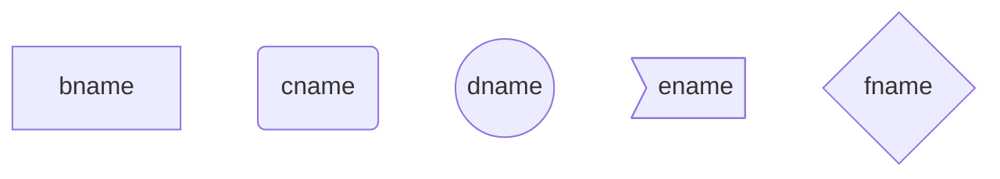
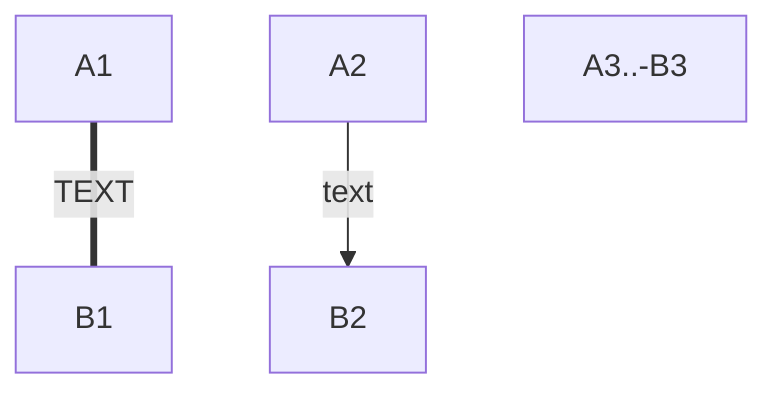
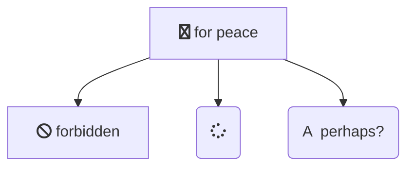
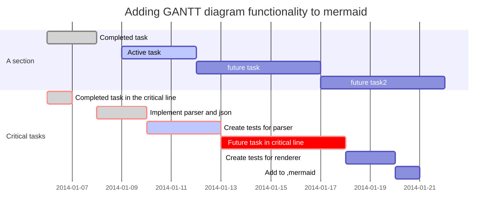

&emsp;&emsp;在写文档过程中经常会遇到画流程图，程序框图等情况。一般在word中用自带的画图功能或者用Visio画好后，进行粘贴复制。在markdown中，使用mermaid插件，也可以愉快的画流程图，不过没word/Visio里面那么无脑，直接拖控件，调整控件的大小，但是画出来的流程图也不错。
&emsp;&emsp;首先设置typora的偏好设置，使其支持mermaid插件。设置方法：文件---偏好设置，找到Markdown扩展语法，勾选 图表（序列图，流程图和mermaid）即可。英文版typora设置方法也是一样的。

### 一、flow流程图
&emsp;&emsp;以代码格式表示，复制以下的代码可直接显示为下图

```
​```flow
st=>start: Start
e=>end: End
op1=>operation: Operation
sub1=>subroutine: Subroutine
cond=>condition: yes or no ?
io=>inputoutput: proceess something...
st->op1->cond`
cond(yes)->io->e`
cond(no)->sub1(right)->op1
​```
```

```flow
st=>start: Start
e=>end: End
op1=>operation: Operation
sub1=>subroutine: Subroutine
cond=>condition: Yes or No ?
io=>inputoutput: proceess something...
st->op1->cond
cond(yes)->io->e
cond(no)->sub1(right)->op1
```

#### 1、语法

&emsp;&emsp;流程图命令
````flow`
．．．
代码段
．．．
` ``` `
定义元素的语法格式为
tag=>type: content:>url
+ tag为流程图中的标签，用于连接元素时用。

+ type为类型，类型主要包括流程图的几种常见格式：   

  | 类型 | start | end  | operation  | subroutine | condition | inputoutput |
  | ---- | ----- | ---- | ---------- | ---------- | --------- | ----------- |
  | 作用 | 开始  | 结束 | 操作、执行 | 子分支     | 条件      | 输入、输出  |
  | 例子 |   st=>start: Start    | e=>end: End | op1=>operation:op | sub=>subroutine: | cond=>condition: yes or no ? | io=>inputoutput: |

+ content为流程图中文本框需要描述的文字，==注意type后面的冒号与content之间有个空格==，不然生成不了流程图

+ url表示一个链接，与框中的文本相绑定，`:>`后面就是对应的 url 链接，点击文本时可以通过链接跳转到 url 指定页面 

+ 用 -> 来连接两个元素
+ 对于condition类型，有yes和no两个分支，如示例中的cond(yes)和cond(no)
+ 每个元素可以设置分支走向，默认向下（bottom），也可以用left指向左边或者用right指向右边，如示例中sub1(right)。

关于流程图的语法说明，此处[※※](https://mermaidjs.github.io/flowchart.html)有更详细的说明

### 二、Graph图表

#### 1、graph关键字

graph TB表示流程图从上到下开始，TB表示设置该图起始的方向，方向的定义如下：

1. TB（ top bottom）表示从上到下 
2. BT（bottom top）表示从下到上
3. RL（right left）表示从右到左
4. LR（left right）表示从左到右

#### 2、节点形状
&emsp;&emsp;大写字母表示节点，name表示节点的名字，主要形状如下：
1. 文本节点 B[bname]

2. 圆角节点 C(cname)

3. 圆形节点 D((dname))

4. 非对称节点 E>ename]

5. 菱形节点 F{fname}
    示例：

    ```
        graph TD
          B[bname]
          C(cname)
          D((dname))
          E>ename]
          F{fname}
    ```



#### 3、连线
&emsp;&emsp;节点间的连接线可以设置多种形状，而且可以在连接线中加入文字text：

1. 箭头连接 A1-->B1
2. 开放连接 A2---B2
3. 标签连接 A3-- text ---B3 或者 A3---|text|B3
4. 箭头标签连接 A4--text-->B4 或者 A4-->|text|B4
5. 虚线开放连接 A5.-B5 或者 A5-.-B5 或者 A5..-B5
6. 虚线箭头连接 A6.->B6 或者 A6-.->B6
7. 标签虚线连接 A7-.text.-B7
8. 标签虚线箭头连接 A8-.text.->B8
9. 粗线开放连接 A9===B9
10. 粗线箭头连接 A10==>B10
11. 标签粗线开放连接 `A11==text===B11`
12. 标签粗线箭头连接`A12==text==>B12`
    示例：

    ```
    graph TD
          A1==TEXT===B1
          A2-->|text|B2
          A3..-B3	
    ```





#### 4、基础fontawesome支持
&emsp;&emsp;如果想加入来自frontawesome的图表字体,需要像frontawesome网站上那样引用的那样。详情请点击：[fontawdsome](https://fontawesome.com/?from=io)
引用的语法为：fa:#icon class name#

```
graph TD
      B["fa:fa-twitter for peace"]
      B-->C[fa:fa-ban forbidden]
      B-->D(fa:fa-spinner);
      B-->E(A fa:fa-camerra-retro perhaps?);
```
示例图如下：


#### 5、渲染效果
```
graph LR
     id1(Start)-->id2(Stop)
     style id1 fill:#f9f,stroke:#333,stroke-width:4px;
     style id2 fill:#f00,stroke:#000,stroke-width:2px,stroke-dasharray:5,5;
```


`style id1 fill:#f9f,stroke:#000,stroke-width:2px,stroke-dasharray:5,5;`
`fill:#f9f`表示框框中填充的颜色，由RGB表示，但只有0~F，如#f00表示填充红色
`stroke:#000,`表示外框的颜色，也是由RGB表示
`stroke-width:2px,`表示外框短线的宽度为2个像素，
`stroke-dasharray:5,5;`表示外框短线的长度，等于方框的边长除以5

有时候为了方便起见，可设置宏定义一样的格式
```
graph LR
classDef className fill:#f9f,stroke:#333,stroke-width:4px;
class nodeId className;	//对结点nodeId使用样式类
class nodeId1,nodeId2 className;	////对多个结点nodeId使用样式类
```
例如对上图的id1使用样式类，效果如下：
```
graph LR
classDef className fill:#f9f,stroke:#333,stroke-width:4px;
class nodeId className;
     id1(Start)-->id2(Stop)
     class id1 className;
     style id2 fill:#f00,stroke:#000,stroke-width:2px,stroke-dasharray:5,5;
```


关于图表的语法说明，此处[※※](https://mermaidjs.github.io/)有更详细的说明

### 三、gantt甘特图
```
gantt
　　　dateFormat　YYYY-MM-DD
　　　title Adding GANTT diagram functionality to mermaid
　　　section A section
　　　Completed task　　:done, des1, 2014-01-06,2014-01-08
　　　Active task 　　　　:active, des2, 2014-01-09, 3d
　　　future task 　　　　:　　　  des3, after des2, 5d
　　　future task2　　　　:　　　  des4, after des3, 5d
　　　section Critical tasks
　　　Completed task in the critical line　:crit, done, 2014-01-06,24h
　　　Implement parser and json　　　　　　:crit, done, after des1, 2d
　　　Create tests for parser　　　　　　　:crit, active, 3d
　　　Future task in critical line　　　　　:crit, 5d
　　　Create tests for renderer　　　　　　:2d
　　　Add to ,mermaid　　　　　　　　　　　:1d

```

关键词说明：
title---标题
dateFormat---日期格式
section---模块
Completed---已经完成
Active---当前正在进行
Future---后续待处理
crit---关键阶段

关于甘特图的语法说明，此处[※※][https://mermaidjs.github.io/gantt.html]有更详细的说明
